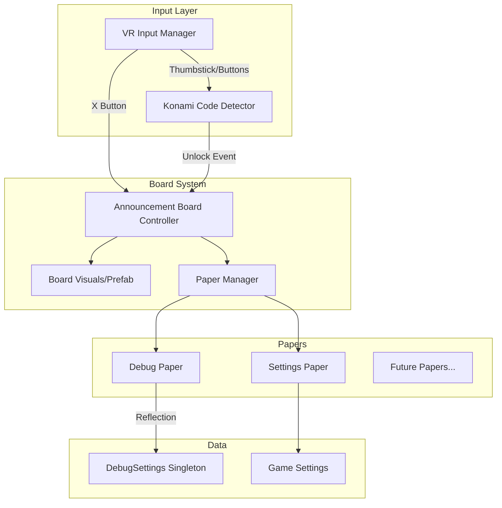

# Design Document: VR Announcement Board Menu System

## Overview

This design describes a VR-accessible settings menu system styled as a physical "Announcement Board" with pinned papers representing different menu sections. The system provides an immersive, world-space interface that matches the existing gun rack aesthetic while supporting extensible menu pages including a hidden Debug page unlocked via the classic Konami code.

Key UX features include:
- **Expandable papers**: Papers display in a compact preview state when unfocused, expanding to full size when selected (similar to Quest Settings app)
- **Label tabs**: Each paper has a small label/tag pinned above it showing its title
- **Left-aligned content**: Debug toggles and headers use left-aligned layout for easy scanning
- **Scrollable content**: Long content lists support thumbstick scrolling with visual indicators
- **Focus-preserving interaction**: Trigger interactions on toggles don't unfocus the paper

## Architecture

The system follows a component-based architecture with clear separation between:
- **Input handling** (Konami code detection, menu toggle)
- **Board management** (visibility, positioning, paper navigation)
- **Paper content** (Settings, Debug, future pages)
- **UI generation** (reflection-based toggle creation for Debug page)



## Components and Interfaces

### 1. AnnouncementBoardController

Main controller managing board visibility, positioning, and state.

```csharp
public class AnnouncementBoardController : MonoBehaviour
{
    // Configuration
    [SerializeField] private float spawnDistance = 1.5f;
    [SerializeField] private float spawnHeight = 1.4f; // Eye level
    [SerializeField] private InputActionReference toggleAction;
    
    // State
    private bool isVisible;
    private bool isDebugUnlocked;
    private MenuPaper currentFocusedPaper;
    
    // Events
    public event Action OnBoardOpened;
    public event Action OnBoardClosed;
    public event Action OnDebugUnlocked;
    
    // Methods
    public void ToggleVisibility();
    public void Show();
    public void Hide();
    public void UnlockDebugPaper();
    public void FocusPaper(MenuPaper paper);
}
```

### 2. KonamiCodeDetector

Detects the VR Konami code input sequence.

```csharp
public class KonamiCodeDetector : MonoBehaviour
{
    // Sequence: Up, Up, Down, Down, Left, Right, Left, Right, B, A
    private readonly KonamiInput[] sequence = {
        KonamiInput.Up, KonamiInput.Up,
        KonamiInput.Down, KonamiInput.Down,
        KonamiInput.Left, KonamiInput.Right,
        KonamiInput.Left, KonamiInput.Right,
        KonamiInput.B, KonamiInput.A
    };
    
    [SerializeField] private float inputTimeout = 2f; // Reset if no input
    [SerializeField] private float thumbstickThreshold = 0.7f;
    
    public event Action OnKonamiCodeEntered;
    
    private int currentIndex;
    private float lastInputTime;
}

public enum KonamiInput { Up, Down, Left, Right, A, B }
```

### 3. MenuPaper (Base Class)

Abstract base for all menu papers with compact/expanded state support.

```csharp
public abstract class MenuPaper : MonoBehaviour
{
    [SerializeField] protected string paperTitle;
    [SerializeField] protected Transform contentRoot;
    [SerializeField] protected Transform placeholderContent; // Shown when compact
    [SerializeField] protected bool isUnlockedByDefault = true;
    
    [Header("Compact/Expanded State")]
    [SerializeField] protected Vector3 compactScale = new Vector3(0.6f, 0.6f, 1f);
    [SerializeField] protected Vector3 expandedScale = Vector3.one;
    [SerializeField] protected float expandedZOffset = -0.1f; // Move toward user
    
    public string Title => paperTitle;
    public bool IsUnlocked { get; protected set; }
    public bool IsFocused { get; protected set; }
    
    public virtual void Initialize() { }
    public virtual void OnFocus() { IsFocused = true; /* Expand */ }
    public virtual void OnUnfocus() { IsFocused = false; /* Compact */ }
    public abstract void RefreshContent();
    
    public void Unlock() { IsUnlocked = true; }
}
```

### 3.1 PaperLabelTab

Small label/tag displayed above each paper showing its title.

```csharp
public class PaperLabelTab : MonoBehaviour
{
    [SerializeField] private TextMeshPro titleText;
    [SerializeField] private Transform tabVisual;
    
    private Vector3 pinnedPosition; // Fixed position on board
    
    public void SetTitle(string title);
    public void SetPinnedPosition(Vector3 position);
    
    // Tab stays at pinnedPosition even when paper expands
    public void OnPaperFocused() { /* Stay in place */ }
    public void OnPaperUnfocused() { /* Stay in place */ }
}
```

### 4. DebugPaper

Debug-specific paper with reflection-based UI generation, scrolling support, and left-aligned layout.

```csharp
public class DebugPaper : MenuPaper
{
    [Header("Toggle Generation")]
    [SerializeField] private GameObject togglePrefab;
    [SerializeField] private GameObject categoryHeaderPrefab;
    [SerializeField] private GameObject toggleAllButtonPrefab;
    
    [Header("Layout")]
    [SerializeField] private float leftMargin = 0.02f;
    [SerializeField] private float categoryIndent = 0f;
    [SerializeField] private float toggleIndent = 0.03f;
    [SerializeField] private TextAlignmentOptions textAlignment = TextAlignmentOptions.Left;
    
    [Header("Scrolling")]
    [SerializeField] private PaperScrollController scrollController;
    
    private Dictionary<string, List<DebugToggleBinding>> categoryToggles;
    
    public override void Initialize()
    {
        isUnlockedByDefault = false;
        GenerateTogglesFromDebugSettings();
        ConfigureScrolling();
    }
    
    private void GenerateTogglesFromDebugSettings();
    private void CreateCategorySection(string category, PropertyInfo[] properties);
    private void OnToggleChanged(PropertyInfo property, bool value);
    private void OnToggleAllPressed(string category);
    private void ConfigureScrolling();
}
```

### 4.1 PaperScrollController

Handles scrolling for papers with content that exceeds the visible area.

```csharp
public class PaperScrollController : MonoBehaviour
{
    [Header("Scroll Configuration")]
    [SerializeField] private RectTransform viewport;
    [SerializeField] private RectTransform content;
    [SerializeField] private float scrollSpeed = 0.1f;
    [SerializeField] private float thumbstickDeadzone = 0.2f;
    
    [Header("Visual Feedback")]
    [SerializeField] private GameObject scrollIndicator;
    [SerializeField] private RectTransform scrollHandle;
    [SerializeField] private GameObject topBoundaryIndicator;
    [SerializeField] private GameObject bottomBoundaryIndicator;
    
    public bool IsScrollingEnabled { get; private set; }
    public float ScrollPosition { get; private set; } // 0-1 normalized
    
    public void EnableScrolling(bool enable);
    public void ScrollByThumbstick(float thumbstickY);
    public void ScrollToTop();
    public void ScrollToBottom();
    
    private void UpdateScrollIndicator();
    private void ShowBoundaryFeedback(bool isTop);
}
```

### 4.2 DebugToggleInteraction (Updated)

Handles VR interaction with toggles without unfocusing the paper.

```csharp
public class DebugToggleInteraction : MonoBehaviour, IXRHoverInteractable
{
    private Toggle toggle;
    private MenuPaper parentPaper;
    
    // When trigger pressed on toggle, toggle the value but DON'T unfocus paper
    public void OnSelectEntered(SelectEnterEventArgs args)
    {
        toggle.isOn = !toggle.isOn;
        // Do NOT call PaperManager.FocusPaper or unfocus
    }
    
    // Prevent click-through to paper background
    public void OnHoverEntered(HoverEnterEventArgs args)
    {
        // Block raycast from hitting paper behind
    }
}
```

### 5. DebugCategoryAttribute

Custom attribute for categorizing debug properties.

```csharp
[AttributeUsage(AttributeTargets.Property)]
public class DebugCategoryAttribute : Attribute
{
    public string Category { get; }
    public DebugCategoryAttribute(string category) => Category = category;
}
```

### 6. PaperManager

Manages paper collection, navigation, and label tabs.

```csharp
public class PaperManager : MonoBehaviour
{
    [SerializeField] private List<MenuPaper> papers;
    [SerializeField] private Transform paperSpawnParent;
    [SerializeField] private GameObject labelTabPrefab;
    [SerializeField] private float labelTabYOffset = 0.18f; // Above paper
    
    private MenuPaper focusedPaper;
    private Dictionary<MenuPaper, PaperLabelTab> paperLabelTabs;
    
    public IReadOnlyList<MenuPaper> UnlockedPapers => 
        papers.Where(p => p.IsUnlocked).ToList();
    
    public void FocusPaper(MenuPaper paper);
    public void AddPaper(MenuPaper paper);
    public void RefreshPaperVisibility();
    
    // Label tab management
    private void CreateLabelTabForPaper(MenuPaper paper);
    private void UpdateLabelTabVisibility();
}
```

## Data Models

### DebugToggleBinding

Runtime binding between UI toggle and DebugSettings property.

```csharp
public class DebugToggleBinding
{
    public PropertyInfo Property { get; set; }
    public Toggle UIToggle { get; set; }
    public string Category { get; set; }
    public string DisplayName { get; set; }
    public string Tooltip { get; set; }
    
    public void SyncFromSettings();
    public void SyncToSettings();
}
```

### BoardState

Serializable state for session persistence.

```csharp
[Serializable]
public class BoardState
{
    public bool IsDebugUnlocked;
    public string LastFocusedPaper;
}
```

## Correctness Properties

*A property is a characteristic or behavior that should hold true across all valid executions of a system-essentially, a formal statement about what the system should do. Properties serve as the bridge between human-readable specifications and machine-verifiable correctness guarantees.*


### Property 1: Toggle Visibility Idempotence
*For any* initial visibility state of the Announcement_Board, pressing the toggle button twice SHALL return the board to its original state.
**Validates: Requirements 1.1, 7.2**

### Property 2: Board Positioning Within Bounds
*For any* player camera position and rotation, when the Announcement_Board becomes visible, it SHALL be positioned between 1.0 and 2.0 meters in front of the camera, at a height within 0.2 meters of eye level, and facing the player (forward vector pointing toward camera).
**Validates: Requirements 1.3**

### Property 3: Unlocked Papers Visibility Consistency
*For any* set of Menu_Papers with varying unlock states, the Announcement_Board SHALL display exactly those papers where IsUnlocked is true, and hide all papers where IsUnlocked is false.
**Validates: Requirements 2.1, 2.4**

### Property 4: Paper Focus Exclusivity
*For any* paper selection action, exactly one Menu_Paper SHALL be in focus at a time, and that paper SHALL be the one that was selected.
**Validates: Requirements 2.2, 2.3**

### Property 5: Toggle Count Matches Debug Properties
*For any* DebugSettings configuration, the number of toggles generated on the Debug_Paper SHALL equal the number of public boolean properties in DebugSettings.
**Validates: Requirements 3.1, 5.1**

### Property 6: Toggle-to-Settings Synchronization
*For any* toggle value change on the Debug_Paper, the corresponding DebugSettings property SHALL immediately reflect the new value.
**Validates: Requirements 3.2**

### Property 7: Settings-to-Toggle Synchronization (Round Trip)
*For any* DebugSettings property change made externally, the corresponding toggle on the Debug_Paper SHALL update to reflect the new value.
**Validates: Requirements 3.3**

### Property 8: Category Grouping Correctness
*For any* debug property with a DebugCategory attribute, the corresponding toggle SHALL appear under a category header matching that attribute's value, and each non-empty category SHALL have exactly one header.
**Validates: Requirements 4.1, 4.2, 4.3, 5.2**

### Property 9: Toggle All Button Presence
*For any* category header displayed on the Debug_Paper, there SHALL be exactly one "Toggle All" button adjacent to that header.
**Validates: Requirements 6.1**

### Property 10: Toggle All Majority Logic
*For any* category with N toggles where M are currently on, pressing "Toggle All" SHALL set all N toggles to OFF if M > N/2, otherwise set all N toggles to ON.
**Validates: Requirements 6.2**

### Property 11: Konami Code Detection
*For any* input sequence matching exactly (Up, Up, Down, Down, Left, Right, Left, Right, B, A) on either thumbstick followed by buttons, the system SHALL fire the unlock event exactly once.
**Validates: Requirements 8.2**

### Property 12: Paper State Consistency (Compact vs Expanded)
*For any* Menu_Paper, when unfocused it SHALL have compact scale and placeholder content visible; when focused it SHALL have expanded scale, be positioned forward, and have full content visible.
**Validates: Requirements 10.1, 10.2, 10.3, 10.4**

### Property 13: Toggle Layout Alignment
*For any* generated debug toggle on the Debug_Paper, the toggle label SHALL be left-aligned, toggles SHALL have consistent indentation under their category header, and category headers SHALL have visually distinct styling (larger/bolder font).
**Validates: Requirements 11.1, 11.2, 11.3**

### Property 14: Interaction Focus Preservation
*For any* trigger interaction on a toggle, Toggle All button, or empty space within a focused paper, the paper SHALL remain focused after the interaction completes.
**Validates: Requirements 12.1, 12.2, 12.3**

### Property 15: Label Tab Presence and Positioning
*For any* displayed Menu_Paper, there SHALL be exactly one label tab above it showing the paper's title, the tab SHALL remain visible in both compact and expanded states, and the tab SHALL stay pinned to the board (not move) when the paper expands.
**Validates: Requirements 13.1, 13.2, 13.3, 13.4**

### Property 16: Scroll Functionality
*For any* Debug_Paper where content height exceeds viewport height, scrolling SHALL be enabled with a visible scroll indicator, thumbstick input SHALL change scroll position, and boundary feedback SHALL appear at scroll limits.
**Validates: Requirements 14.1, 14.2, 14.3, 14.4**

## Error Handling

### Input Handling Errors
- **Invalid thumbstick input**: Ignore inputs below threshold (0.7)
- **Timeout during Konami sequence**: Reset sequence after 2 seconds of no input
- **Missing controller**: Gracefully disable input detection, log warning

### Reflection Errors
- **No DebugSettings instance**: Create default instance via singleton pattern
- **Property access exception**: Log error, skip property, continue with others
- **Missing category attribute**: Place toggle in "Uncategorized" section

### UI Errors
- **Missing prefabs**: Log error, disable affected feature
- **Null paper reference**: Skip paper, continue with others

## Testing Strategy

### Property-Based Testing Framework
The project will use **NUnit** with **FsCheck** for property-based testing in Unity's EditMode tests.

### Unit Tests
Unit tests will cover:
- Konami code sequence detection edge cases
- Board positioning calculations
- Toggle binding creation and synchronization
- Category grouping logic

### Property-Based Tests
Each correctness property will be implemented as a property-based test:

1. **Property 1**: Generate random visibility states, apply toggle twice, verify return to original
2. **Property 2**: Generate random Vector3 positions and Quaternion rotations, verify board position within bounds
3. **Property 3**: Generate random unlock state combinations, verify visibility matches
4. **Property 4**: Generate random paper selection sequences, verify single focus
5. **Property 5**: Use reflection to count properties, verify toggle count matches
6. **Property 6**: Generate random toggle changes, verify DebugSettings updates
7. **Property 7**: Generate random DebugSettings changes, verify toggle updates
8. **Property 8**: Generate properties with random categories, verify grouping
9. **Property 9**: Generate random category configurations, verify button presence
10. **Property 10**: Generate random on/off distributions, verify majority logic
11. **Property 11**: Generate input sequences, verify only exact match triggers unlock
12. **Property 12**: Generate random focus/unfocus sequences, verify scale and content visibility states
13. **Property 13**: Generate toggles, verify left alignment and consistent indentation
14. **Property 14**: Simulate trigger interactions on various paper elements, verify focus preserved
15. **Property 15**: Generate papers, verify label tab presence, positioning, and fixed behavior during expand
16. **Property 16**: Generate content of varying heights, verify scroll enablement and indicator behavior

### Test Annotations
Each property-based test MUST include:
```csharp
// **Feature: debug-ui-menu, Property {N}: {property_text}**
// **Validates: Requirements X.Y**
```

### Integration Tests
- End-to-end board summon/dismiss flow
- Konami code unlock flow
- Toggle interaction with DebugSettings

## Visual Design

### Board Appearance
- Cork board or wooden board texture (matching gun rack style)
- Slightly weathered/rustic appearance
- Subtle shadow/depth for 3D presence
- Size: approximately 0.8m wide x 0.6m tall

### Paper Appearance

#### Compact State (Unfocused)
- Smaller scale (60% of full size)
- Off-white/cream colored paper texture
- Slightly dimmed/faded appearance
- Placeholder content: wavy lines or blurred text suggesting content
- Visible push pins or tacks at corners
- Size: approximately 0.15m x 0.21m

#### Expanded State (Focused)
- Full scale (100%)
- Bright, fully visible
- Positioned 1.2-1.5 meters in front of player (increased from ~1m for comfortable reading)
- Full content visible with readable text
- Interactive elements enabled
- Size: approximately 0.35m x 0.45m (increased from 0.25m x 0.35m for more content space)

### Label Tabs
- Small paper/tag style (approximately 0.08m x 0.03m)
- Positioned above each paper
- Pinned with small tack visual
- Shows paper title in handwritten/typewriter font
- Stays fixed on board when paper expands
- Slightly angled for visual interest

### Content Layout (Debug Paper)
- Left-aligned text throughout
- Category headers: Bold, larger font (16pt equivalent)
- Toggle labels: Regular weight, standard font (14pt equivalent)
- Consistent left margin (2cm from paper edge)
- Toggle indent under headers (3cm from paper edge)
- Vertical spacing: 3.5cm between items
- Toggle switch positioned on right side of paper, label on left
- Adequate horizontal space between label and toggle switch

### Toggle Visual Design (iOS-style)
- Toggle track: Pill-shaped background (approximately 5cm x 2.5cm)
- Toggle knob: Circle that slides left/right within track
- OFF state: Knob on left, track gray (#808080)
- ON state: Knob on right, track green (#4CD964) or blue (#007AFF)
- Knob animation: Smooth slide transition (0.15s ease-out)
- Hitbox: Covers entire row (label + toggle) for easier VR interaction

### Toggle All Button Visual
- Distinct button appearance (not just text)
- Background shape with border/outline
- Visual feedback on hover (highlight)
- Visual feedback on press (scale down slightly)
- Icon or checkbox indicator showing current majority state

### Scroll Indicator
- Thin vertical bar on right edge of paper
- Handle shows current scroll position
- Fades in when scrolling enabled
- Top/bottom glow effect at scroll boundaries

### Animations
- Board appear: Scale up from 0 with slight bounce
- Board dismiss: Scale down to 0 with fade
- Paper expand (focus): Scale from 60% to 100%, move forward, brighten (0.3s ease-out)
- Paper compact (unfocus): Scale from 100% to 60%, move back, dim (0.2s ease-in)
- Debug unlock: Paper slides in from side, pin "sticks" with sound
- Scroll: Smooth content movement with momentum

### Audio Feedback
- Board toggle: Soft whoosh sound
- Paper select/expand: Paper rustle sound
- Toggle change: Soft click
- Scroll: Subtle paper slide sound
- Konami success: Classic "power up" chime
- Debug unlock: Pin stick sound + success jingle
