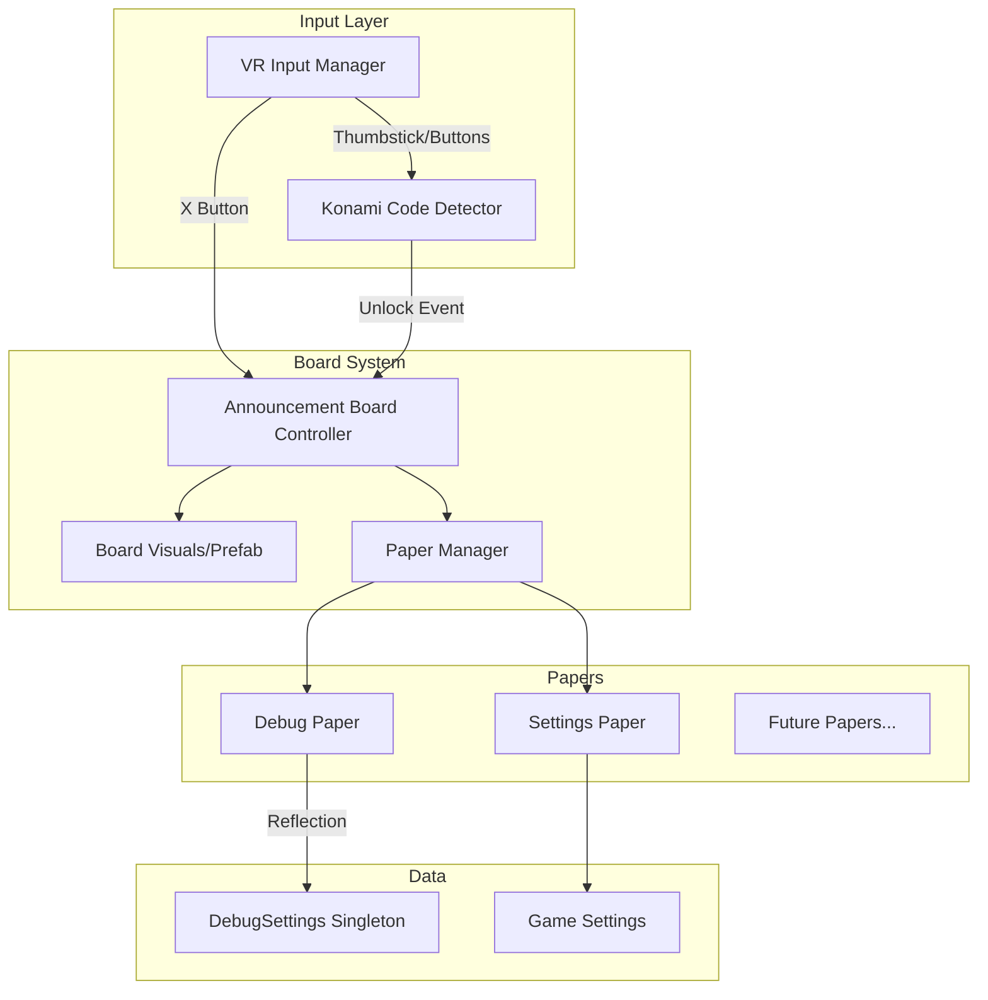

# Design Document: VR Announcement Board Menu System

## Overview

This design describes a VR-accessible settings menu system styled as a physical "Announcement Board" with pinned papers representing different menu sections. The system provides an immersive, world-space interface that matches the existing gun rack aesthetic while supporting extensible menu pages including a hidden Debug page unlocked via the classic Konami code.

## Architecture

The system follows a component-based architecture with clear separation between:
- **Input handling** (Konami code detection, menu toggle)
- **Board management** (visibility, positioning, paper navigation)
- **Paper content** (Settings, Debug, future pages)
- **UI generation** (reflection-based toggle creation for Debug page)



## Components and Interfaces

### 1. AnnouncementBoardController

Main controller managing board visibility, positioning, and state.

```csharp
public class AnnouncementBoardController : MonoBehaviour
{
    // Configuration
    [SerializeField] private float spawnDistance = 1.5f;
    [SerializeField] private float spawnHeight = 1.4f; // Eye level
    [SerializeField] private InputActionReference toggleAction;
    
    // State
    private bool isVisible;
    private bool isDebugUnlocked;
    private MenuPaper currentFocusedPaper;
    
    // Events
    public event Action OnBoardOpened;
    public event Action OnBoardClosed;
    public event Action OnDebugUnlocked;
    
    // Methods
    public void ToggleVisibility();
    public void Show();
    public void Hide();
    public void UnlockDebugPaper();
    public void FocusPaper(MenuPaper paper);
}
```

### 2. KonamiCodeDetector

Detects the VR Konami code input sequence.

```csharp
public class KonamiCodeDetector : MonoBehaviour
{
    // Sequence: Up, Up, Down, Down, Left, Right, Left, Right, B, A
    private readonly KonamiInput[] sequence = {
        KonamiInput.Up, KonamiInput.Up,
        KonamiInput.Down, KonamiInput.Down,
        KonamiInput.Left, KonamiInput.Right,
        KonamiInput.Left, KonamiInput.Right,
        KonamiInput.B, KonamiInput.A
    };
    
    [SerializeField] private float inputTimeout = 2f; // Reset if no input
    [SerializeField] private float thumbstickThreshold = 0.7f;
    
    public event Action OnKonamiCodeEntered;
    
    private int currentIndex;
    private float lastInputTime;
}

public enum KonamiInput { Up, Down, Left, Right, A, B }
```

### 3. MenuPaper (Base Class)

Abstract base for all menu papers.

```csharp
public abstract class MenuPaper : MonoBehaviour
{
    [SerializeField] protected string paperTitle;
    [SerializeField] protected Transform contentRoot;
    [SerializeField] protected bool isUnlockedByDefault = true;
    
    public string Title => paperTitle;
    public bool IsUnlocked { get; protected set; }
    
    public virtual void Initialize() { }
    public virtual void OnFocus() { }
    public virtual void OnUnfocus() { }
    public abstract void RefreshContent();
    
    public void Unlock() { IsUnlocked = true; }
}
```

### 4. DebugPaper

Debug-specific paper with reflection-based UI generation.

```csharp
public class DebugPaper : MenuPaper
{
    [SerializeField] private GameObject togglePrefab;
    [SerializeField] private GameObject categoryHeaderPrefab;
    [SerializeField] private GameObject toggleAllButtonPrefab;
    
    private Dictionary<string, List<DebugToggleBinding>> categoryToggles;
    
    public override void Initialize()
    {
        isUnlockedByDefault = false;
        GenerateTogglesFromDebugSettings();
    }
    
    private void GenerateTogglesFromDebugSettings();
    private void CreateCategorySection(string category, PropertyInfo[] properties);
    private void OnToggleChanged(PropertyInfo property, bool value);
    private void OnToggleAllPressed(string category);
}
```

### 5. DebugCategoryAttribute

Custom attribute for categorizing debug properties.

```csharp
[AttributeUsage(AttributeTargets.Property)]
public class DebugCategoryAttribute : Attribute
{
    public string Category { get; }
    public DebugCategoryAttribute(string category) => Category = category;
}
```

### 6. PaperManager

Manages paper collection and navigation.

```csharp
public class PaperManager : MonoBehaviour
{
    [SerializeField] private List<MenuPaper> papers;
    [SerializeField] private Transform paperSpawnParent;
    
    private MenuPaper focusedPaper;
    
    public IReadOnlyList<MenuPaper> UnlockedPapers => 
        papers.Where(p => p.IsUnlocked).ToList();
    
    public void FocusPaper(MenuPaper paper);
    public void AddPaper(MenuPaper paper);
    public void RefreshPaperVisibility();
}
```

## Data Models

### DebugToggleBinding

Runtime binding between UI toggle and DebugSettings property.

```csharp
public class DebugToggleBinding
{
    public PropertyInfo Property { get; set; }
    public Toggle UIToggle { get; set; }
    public string Category { get; set; }
    public string DisplayName { get; set; }
    public string Tooltip { get; set; }
    
    public void SyncFromSettings();
    public void SyncToSettings();
}
```

### BoardState

Serializable state for session persistence.

```csharp
[Serializable]
public class BoardState
{
    public bool IsDebugUnlocked;
    public string LastFocusedPaper;
}
```

## Correctness Properties

*A property is a characteristic or behavior that should hold true across all valid executions of a system-essentially, a formal statement about what the system should do. Properties serve as the bridge between human-readable specifications and machine-verifiable correctness guarantees.*


### Property 1: Toggle Visibility Idempotence
*For any* initial visibility state of the Announcement_Board, pressing the toggle button twice SHALL return the board to its original state.
**Validates: Requirements 1.1, 7.2**

### Property 2: Board Positioning Within Bounds
*For any* player camera position and rotation, when the Announcement_Board becomes visible, it SHALL be positioned between 1.0 and 2.0 meters in front of the camera, at a height within 0.2 meters of eye level, and facing the player (forward vector pointing toward camera).
**Validates: Requirements 1.3**

### Property 3: Unlocked Papers Visibility Consistency
*For any* set of Menu_Papers with varying unlock states, the Announcement_Board SHALL display exactly those papers where IsUnlocked is true, and hide all papers where IsUnlocked is false.
**Validates: Requirements 2.1, 2.4**

### Property 4: Paper Focus Exclusivity
*For any* paper selection action, exactly one Menu_Paper SHALL be in focus at a time, and that paper SHALL be the one that was selected.
**Validates: Requirements 2.2, 2.3**

### Property 5: Toggle Count Matches Debug Properties
*For any* DebugSettings configuration, the number of toggles generated on the Debug_Paper SHALL equal the number of public boolean properties in DebugSettings.
**Validates: Requirements 3.1, 5.1**

### Property 6: Toggle-to-Settings Synchronization
*For any* toggle value change on the Debug_Paper, the corresponding DebugSettings property SHALL immediately reflect the new value.
**Validates: Requirements 3.2**

### Property 7: Settings-to-Toggle Synchronization (Round Trip)
*For any* DebugSettings property change made externally, the corresponding toggle on the Debug_Paper SHALL update to reflect the new value.
**Validates: Requirements 3.3**

### Property 8: Category Grouping Correctness
*For any* debug property with a DebugCategory attribute, the corresponding toggle SHALL appear under a category header matching that attribute's value, and each non-empty category SHALL have exactly one header.
**Validates: Requirements 4.1, 4.2, 4.3, 5.2**

### Property 9: Toggle All Button Presence
*For any* category header displayed on the Debug_Paper, there SHALL be exactly one "Toggle All" button adjacent to that header.
**Validates: Requirements 6.1**

### Property 10: Toggle All Majority Logic
*For any* category with N toggles where M are currently on, pressing "Toggle All" SHALL set all N toggles to OFF if M > N/2, otherwise set all N toggles to ON.
**Validates: Requirements 6.2**

### Property 11: Konami Code Detection
*For any* input sequence matching exactly (Up, Up, Down, Down, Left, Right, Left, Right, B, A) on either thumbstick followed by buttons, the system SHALL fire the unlock event exactly once.
**Validates: Requirements 8.2**

## Error Handling

### Input Handling Errors
- **Invalid thumbstick input**: Ignore inputs below threshold (0.7)
- **Timeout during Konami sequence**: Reset sequence after 2 seconds of no input
- **Missing controller**: Gracefully disable input detection, log warning

### Reflection Errors
- **No DebugSettings instance**: Create default instance via singleton pattern
- **Property access exception**: Log error, skip property, continue with others
- **Missing category attribute**: Place toggle in "Uncategorized" section

### UI Errors
- **Missing prefabs**: Log error, disable affected feature
- **Null paper reference**: Skip paper, continue with others

## Testing Strategy

### Property-Based Testing Framework
The project will use **NUnit** with **FsCheck** for property-based testing in Unity's EditMode tests.

### Unit Tests
Unit tests will cover:
- Konami code sequence detection edge cases
- Board positioning calculations
- Toggle binding creation and synchronization
- Category grouping logic

### Property-Based Tests
Each correctness property will be implemented as a property-based test:

1. **Property 1**: Generate random visibility states, apply toggle twice, verify return to original
2. **Property 2**: Generate random Vector3 positions and Quaternion rotations, verify board position within bounds
3. **Property 3**: Generate random unlock state combinations, verify visibility matches
4. **Property 4**: Generate random paper selection sequences, verify single focus
5. **Property 5**: Use reflection to count properties, verify toggle count matches
6. **Property 6**: Generate random toggle changes, verify DebugSettings updates
7. **Property 7**: Generate random DebugSettings changes, verify toggle updates
8. **Property 8**: Generate properties with random categories, verify grouping
9. **Property 9**: Generate random category configurations, verify button presence
10. **Property 10**: Generate random on/off distributions, verify majority logic
11. **Property 11**: Generate input sequences, verify only exact match triggers unlock

### Test Annotations
Each property-based test MUST include:
```csharp
// **Feature: debug-ui-menu, Property {N}: {property_text}**
// **Validates: Requirements X.Y**
```

### Integration Tests
- End-to-end board summon/dismiss flow
- Konami code unlock flow
- Toggle interaction with DebugSettings

## Visual Design

### Board Appearance
- Cork board or wooden board texture (matching gun rack style)
- Slightly weathered/rustic appearance
- Subtle shadow/depth for 3D presence
- Size: approximately 0.8m wide x 0.6m tall

### Paper Appearance
- Off-white/cream colored paper texture
- Slightly crumpled/worn edges
- Visible push pins or tacks at corners
- Handwritten-style or typewriter font for headers
- Size: approximately 0.25m x 0.35m per paper

### Animations
- Board appear: Scale up from 0 with slight bounce
- Board dismiss: Scale down to 0 with fade
- Paper focus: Slight scale up (1.1x), move forward, brighten
- Paper unfocus: Return to normal scale, move back, dim
- Debug unlock: Paper slides in from side, pin "sticks" with sound

### Audio Feedback
- Board toggle: Soft whoosh sound
- Paper select: Paper rustle sound
- Toggle change: Soft click
- Konami success: Classic "power up" chime
- Debug unlock: Pin stick sound + success jingle
